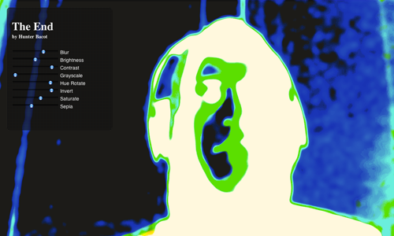

<h1>The End<h1>

Fall 2012

This project is an experimental look into the emerging capabilities offered by google chrome, HTML5, and CSS3. The end result is a reflective view of the user in their environment and distorted by the available set of CSS3 filters. The video is generated by google chrome’s support for cameras native to the computer through a javascript API. For this project to work you must be using Google Chrome and have a webcam. 
	 
	This project can be viewed live at <a href="http://hunterbacot.com/end" target="_blank">hunterbacot.com/end</a>.
